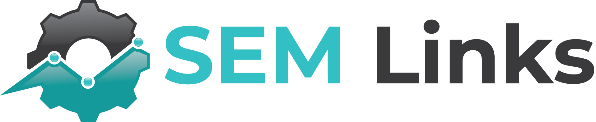

<!-- PROJECT SHIELDS -->

[![Contributors][contributors-shield]][contributors-url]
[![Forks][forks-shield]][forks-url]
[![Stargazers][stars-shield]][stars-url]
[![Issues][issues-shield]][issues-url]

<!-- PROJECT LOGO -->
 

  
  <h3 align="center">SEM Links</h3>
  

    Search Engine Marketing (SEM) Links, which is the working title, is a Search Engine Optimization (SEO) tool. The current goal is to tackle all of the technical SEO areas of concern. The end goal aims much higher.
     
     
    <a href="https://github.com/carbondigitalus/sem-links/issues" target="_blank">Bugs</a>
    ·
    <a href="https://semlinks.canny.io/semlinks" target="_blank">Features</a>
    ·
    <a href="https://discord.gg/jatU44PavX" target="_blank">Discord Community</a>
  

<!-- TABLE OF CONTENTS -->
<aside>
  
Table of Contents

  <ol>
    <li>
      <a href="#about-the-project">About The Project</a>
      <ul>
        <li><a href="#built-with">Built With</a></li>
      </ul>
    </li>
    <li><a href="#usage">Usage</a></li>
    <li><a href="#roadmap">Roadmap</a></li>
    <li><a href="#contributing">Contributing</a></li>
    <li><a href="#acknowledgments">Acknowledgments</a></li>
  </ol>
</aside>

<!-- ABOUT THE PROJECT -->

## About The Project

We wanted a tool internally that would help us rapidly scale our SEO efforts, but ultimately, give us the ability to migrate offf our current toolchain for SEO. Like many agencies, our team spent thousands on SEO-realted software each year. Since we're not a multi-million dollar agency, it always hurts to pay those bills.

In light of that, we are building this software initially for our own team. We have already seen the power of competing with well-known tools that currently exist. One thing we aim to achieve is more honesty and more transparency. This is why we are building some modules has open-source NPM packages. So, give all developers the ability to see exactly what we're doing and contribute if they desire.

(<a href="#top">back to top</a>)

### Built With

Below are the major frameworks/libraries that are currently used in this project, or soon to be added in a future release.

- [jQuery](https://jquery.com)
- [NestJS](https://nestjs.com)
- [Node.js](https://nodejs.org/)
- [React](https://reactjs.org/)
- [TypeORM](https://typeorm.io)
- [TypeScript](https://typescript.com/)

(<a href="#top">back to top</a>)

<!-- USAGE EXAMPLES -->

## Usage

Usage docs coming soon.

<!--
_For more examples, please refer to the [Documentation](https://example.com)_
-->

(<a href="#top">back to top</a>)

<!-- ROADMAP -->

## Roadmap

We've got a simple setup on Canny. You can submit either a Github issue, or a Canny feature request for the SEM Links tool.

- [Feature Requests in Canny](https://semlinks.canny.io/semlinks)

(<a href="#top">back to top</a>)

<!-- CONTRIBUTING -->

## Contributing

Contributions are what make the open source community such an amazing place to learn, inspire, and create. Any contributions you make are **greatly appreciated**.

If you have a suggestion that would make this better, please fork the repo and create a pull request. You can also simply open an issue with the tag "enhancement".
Don't forget to give the project a star! Thanks again!

1. Fork the Project
2. Create your Feature Branch (`git checkout -b feature/AmazingFeature`)
3. Commit your Changes (`git commit -m 'Add some AmazingFeature'`)
4. Push to the Branch (`git push origin feature/AmazingFeature`)
5. Open a Pull Request

(<a href="#top">back to top</a>)

<!-- ACKNOWLEDGMENTS -->

## Acknowledgments

Without these people and tools, life would be too complicated.

- Family and Friends.
- Ramen, Rice, Cheeseburgers and Pizza.
- [Carbon Digital](https://carbondigital.us)
- [Font Awesome](https://fontawesome.com)
- [VS Code](https://code.visualstudio.com/)

(<a href="#top">back to top</a>)

<!-- MARKDOWN LINKS & IMAGES -->
<!-- https://www.markdownguide.org/basic-syntax/#reference-style-links -->

[contributors-shield]: https://img.shields.io/github/contributors/carbondigitalus/sem-links.svg?style=for-the-badge
[contributors-url]: https://github.com/carbondigitalus/sem-links/graphs/contributors
[forks-shield]: https://img.shields.io/github/forks/carbondigitalus/sem-links.svg?style=for-the-badge
[forks-url]: https://github.com/carbondigitalus/sem-links/network/members
[stars-shield]: https://img.shields.io/github/stars/carbondigitalus/sem-links.svg?style=for-the-badge
[stars-url]: https://github.com/carbondigitalus/sem-links/stargazers
[issues-shield]: https://img.shields.io/github/issues/carbondigitalus/sem-links.svg?style=for-the-badge
[issues-url]: https://github.com/carbondigitalus/sem-links/issues
[license-shield]: https://img.shields.io/github/license/carbondigitalus/sem-links.svg?style=for-the-badge
[license-url]: https://github.com/carbondigitalus/sem-links/blob/master/license.md
